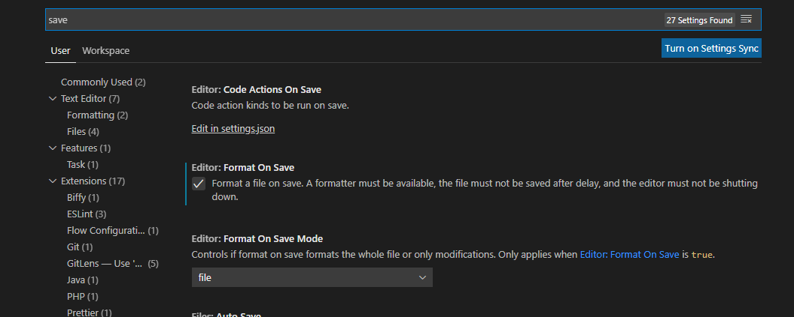

# Writing-Unit-Tests-Angular
How To Write Unit Tests For Angular Jasmine

# UI Coding Standards & Guidelines

# Contents
----
- [Setting Up ESLint In Visual Studio Code](#Setting-Up-ESLint-In-Visual-Studio-Code)
- [Writing Unit Tests](#Writing-Unit-Tests)
  - [Helpful Tips](#Helpful-Tips)
  - [HTML Tests](#HTML-Tests)
  - [TS Tests](#TS-Tests)
  - [Writing Integration Tests](#Writing-Integration-Tests)

# Setting Up ESLint In Visual Studio Code
---
We use ESLint to automatically check the syntax, formatting and conventions of our code. When you run `ng lint` it will go through all the syntax rules in `.eslintrc.js` and check our code against them. However you can set up ESLint to hightlight any potential issues within the editor as you type your code.

Within Visual Studio Code, install the ESLint extension and make sure to remove the TSLint extension. You can do this only for this project, so you don't affect the installed extensions for other projects/repos. 

You can also set up Visual Studio to automatically reformat and indent your code to align with the ESLint rules when you save a file. Go to File->Preferences->Settings. In the search bar, type 'save' and check the Format On Save box. You can also decide whether you want to format the file on save or the whole project.



Then go to the settings for the ESLint extension and Enable ESLint as a formatter.


# Writing Unit Tests
---

In short, you should test everything that could possibly change or cause some event or function to be called. We do not test every static element and every single class that is applied to each element. But we do test that the correct child components we created are present and any classes that vary i.e ```[ngClass]```.

We use ```testing-utils.ts``` to provide a reusable ```TestBed``` where we import all the shared modules and mock all the services. We then import this ```TestBed``` into the unit test spec file for each component and add what we need to it. This ensures we only use mocked services in each component and that we don’t have to redefine these mocked services in every component.

For each unit test we then only have to add the declaration for the component we are testing and declarations for any mocked child components. We shouldn’t have to redefine the mocked services here. If we need to change what a function of a service returns for a particular unit test we can use a jasmine spy and change the return value temporarily.

```js
spyOn(httpClient, 'get').and.returnValue(throwError(error));
```

Avoid using ```toBeTruthy()``` and ```toBeFalsy()```, only use these when checking a component exists or checking a function that returns a ```boolean```. Don’t use them when checking inputs and fields as ```isLoading``` which should be a ```boolean``` could be the number 5 and the test will pass.

When testing inputs to child components grab the component using the componentInstance
``` js
const projectStatusSelectorComponent = componentFixture.debugElement.query(By.css('#sltShowProjectTypeSolutionDashboard')).componentInstance;
```

``` js
const hierarchySelectorComponent = componentFixture.debugElement.query(By.directive(HierarchySelectorMockComponent)).componentInstance;
```
    
# Helpful Tips
---

You can run the unit tests for just one file by replacing `describe` with `fdescribe` to focus only on those unit tests. Similarly, you can run an individual unit test by replacing `it` with `fit`. But make sure to remove these again when you are done.

If you go to ```localhost:9876``` you can load up a UI that displays the components you are testing and the results.

# HTML Tests
---

- You should test that key components are present and displayed in the UI
- You should test that any important text is displaying correctly in the UI.
- You should test every ```*ngIf``` and that components are displaying or not displaying depending on the value of variables
- You should test every ```*ngFor``` and that components are displaying the correct number of elements.
- You should test ```[ngClass]``` and that the right classes are applied depending on the value of variables.
- You should test child components call the correct function when their output event is emitted.
- You should test child components are passed the correct inputs.

Make sure to grab the element through the ```debugElement``` instead of the ```nativeElement``` e.g. ```componentFixture.debugElement.query(By.css(‘#anId’)).componentInstance```

# TS Tests
---

You do not have to test the inner workings of a function just that different inputs result in the right functions being called and the right fields being changed. If private fields are changed you can use key object notation to retrieve it still instead of dot notation. ```component[‘privateField’]``` instead of ```component.privateField```.

- You should test fields are initialized to the correct values.
- For each function you should test enough inputs that every part of function is executed.
- For each function you should test that other functions are called depending on its inputs.
- For each function you should test that fields are changed to the correct values depending on its inputs.

# Writing Integration Tests
---

In unit tests we replace all the child components and services with simple mocked versions. In Integration tests we include the actual child components. We write integration tests in a separate file. There are automated integration tests written by testers so developers shouldn’t have to write many of these.

There are many different integration tests we could create. We should make sure to agree on what to write integration tests for before writing any. We usually only test the most important and complex components that may have a lot of child components or experience bugs in the past.
